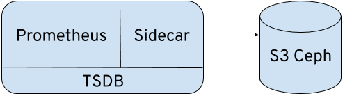
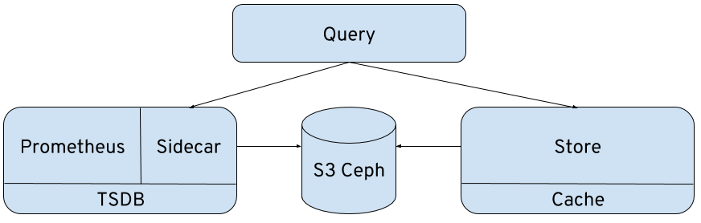

# Thanos - long term storage for your Prometheus Metrics on OpenShift

## Thanos? Another greek guy?

[Thanos](https://github.com/improbable-eng/thanos) is a project that turns your [prometheus](https://prometheus.io/) installation into a highly available metric system with unlimited storage capacity. From a very high-level view, it does this by deploying a sidecar to prometheus, which uploads the data blocks to any object storage. A store component downloads the blocks again and makes them accessible to a query component, which has the same API as prometheus itself. This works nicely with Grafana because its the same API. So without much effort, you essentially get an unlimited timeline of your nice dashboard graphs.

On top of these already awesome features, Thanos also provides downsampling of stored metrics, deduplication of data points and some more. 

## Motivation
We are mostly interested in the unlimited storage of prometheus data. For our data science work, we need more than just a couple of days worth of data. We might want to go back months in time. Still, we don't want to add more complexity to the tooling but stay with the prometheus query API and PromQL we already know.

We're can re-use our Grafana dashboards, [ML Containers](https://github.com/AICoE/prometheus-anomaly-detector) and [Jupyter Notebooks](https://github.com/AICoE/DataScience-on-Prometheus-Metrics/)

## Setup
We are using the S3 access points from [Ceph](https://ceph.com/) to store the Time Series DB (TSDB) blocks in a bucket.  We also need to deploy on top of a managed OpenShift installation, so we can't tune any network configurations or use cluster admin for our setup.

The first [problem](https://github.com/improbable-eng/thanos/issues/615) we've encountered is the gossip protocol that Thanos uses to find new nodes added to the Thanos cluster. But as we just want to store blocks from a single prometheus instance, we're not really interested in the clustered setup. To get around this, you have to tell every Thanos component to listen to a cluster address, but don't use it for cluster discovery. Instead, use the `--store` flag to specify the nodes directly. And gossip is probably being [removed](https://github.com/improbable-eng/thanos/blob/master/docs/proposals/approved/201809_gossip-removal.md) from Thanos anyway, so :shrug:

We're also building on top of the [OKD prometheus examples](https://github.com/openshift/origin/tree/release-3.11/examples/prometheus), hence you'll see diffs in this post, which should be easy to apply to your setup.

## Just the sidecar



This is the least intrusive deployment. You can just add this without interfering with you prometheus at all. 
One thing that you might need to add to your prometheus configuration is the `external_labels` section and `--storage.tsdb.{min, max}-block-duration` setting. See the (sidecar documentation)[https://github.com/improbable-eng/thanos/blob/master/docs/components/sidecar.md#sidecar] for the reasoning.
Here are the [full deployment template](prometheus_thanos_sidecar.yaml) and the [diff](prometheus_thanos_sidecar.yaml.patch) to the [original deployment template](https://github.com/openshift/origin/blob/release-3.11/examples/prometheus/prometheus.yaml).

```
oc process -f ./prometheus_thanos_sidecar.yaml --param THANOS_ACCESS_KEY=abc --param THANOS_SECRET_KEY=xyz | oc apply -f -
```

Deploying this will store the TSDB blocks in the configured S3 bucket. Now, how would you query those offloaded blocks?

## Thanos Query



Now we've added Thanos Query, a web and API frontend which looks like prometheus, but is able to query a prometheus instance *and* a Thanos Store at the same time. This gives you transparent access to the archived blocks and real-time metrics.

```
oc process -f ./prometheus_thanos_full.yaml --param THANOS_ACCESS_KEY=abc --param THANOS_SECRET_KEY=xyz | oc apply -f -
```

## Taco Wrap Up
You should start with just the sidecar deployment to start backing up your metrics. If you don't even want to fiddle with the prometheus setup or you don't have access to it, you can also use the [federate](https://prometheus.io/docs/prometheus/latest/federation/) API from prometheus to deploy another instance just for doing the backup. This is actually how we do it because other teams run the production prometheus.

Then let it run for a couple of days and estimate the storage requirements.

After this, have fun with the query and store component and enjoy your unlimited way back in time of metrics.

